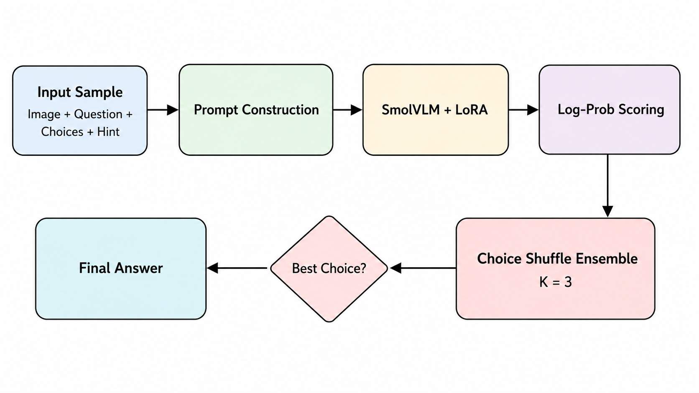
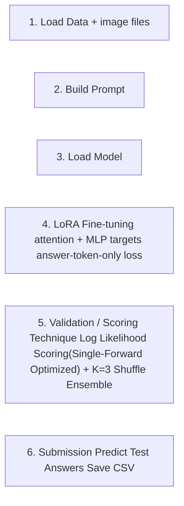

# Improving Visual Multiple-Choice Question Answering with LoRA Fine-tuning and Scoring Technique

This project focuses on **visual question answering (VQA)** for a ScienceQA-style Kaggle competition. Given an image, a question, and **3–5 answer choices**, the goal is to predict the correct answer index.

We propose a **prompt-format + scoring-technique + LoRA fine-tuning pipeline**. The final system improves performance by using next-token answer-letter scoring, LoRA targets on both attention and MLP layers, choice-shuffle training, and inference-time shuffle ensemble.

---

## Overview

### Reproducible Pipeline

This project can be reproduced by running the final notebook `pixtopred_final.ipynb` from top to bottom. The pipeline below follows the actual code structure in the notebook.
<p align="center">
  
</p>



The pipeline consists of the following reproducible steps:

1. **Load data and image files**

   The notebook reads the competition files from the configured data directory:

   ```python
   DATA_DIR = Path("/content/drive/MyDrive/dl_final/")
   train_df = pd.read_csv(DATA_DIR / "train.csv")
   val_df   = pd.read_csv(DATA_DIR / "val.csv")
   test_df  = pd.read_csv(DATA_DIR / "test.csv")
   ```

   Expected structure:

   ```text
   dl_final/
   ├── train.csv
   ├── val.csv
   ├── test.csv
   └── images/
       ├── train/
       ├── val/
       └── test/
   ```

2. **Build the prompt format**

   The code parses the `choices` column, loads each image, and constructs a prompt with:

   - image input
   - hint-based context
   - question
   - answer choices formatted as `A.`, `B.`, `C.`, ...
   - final answer phrase: `Answer (single letter):`

   The prompt format follows the prompt-engineering strategy of experimenting with answer phrases such as `Answer:` / `The correct answer is:` and selecting a format that works better for next-token scoring.

3. **Load SmolVLM and apply LoRA targets**

   The notebook loads:

   ```python
   MODEL_ID = "HuggingFaceTB/SmolVLM-500M-Instruct"
   ```

   LoRA adapters are applied to both:

   - attention projection layers: `q_proj`, `k_proj`, `v_proj`, `o_proj`
   - MLP layers: `gate_proj`, `up_proj`, `down_proj`

   The base model remains mostly frozen, while the trainable LoRA parameters stay under the competition parameter budget.

4. **Run LoRA fine-tuning with answer-token-only loss and choice shuffle**

   During fine-tuning, the data collator masks the prompt tokens and computes loss only on the final answer letter. Training choices are randomly shuffled, and the gold answer index is updated accordingly.

   Final training configuration:

   ```python
   SHUFFLE_AUG_REPEAT = 2
   NUM_EPOCHS = 2
   TRAIN_SHUFFLE = True
   ```

   This gives `2 × 2 = 4` effective training views.

5. **Validate with the scoring technique and K=3 shuffle ensemble**

   Instead of free-form answer generation, the model compares the next-token log probabilities of valid answer letters:

   ```text
   P(A), P(B), P(C), P(D), P(E)
   ```

   At validation and test time, each sample is evaluated under `K=3` choice permutations. Scores are mapped back to the original choice indices and averaged.

6. **Generate the Kaggle submission file**

   The notebook predicts answers for `test.csv` and saves a submission file with the required format:

   ```text
   id,answer
   test_00000,2
   test_00001,0
   ...
   ```

   The code also checks that:

   - the number of rows matches `test.csv`
   - the columns are exactly `id` and `answer`
   - no answer is missing
   - every predicted answer index is within the valid choice range

Our final method consists of:

- prompt-format redesign with hint-based context
- single-letter answer target: `Answer (single letter):`
- next-token log-probability scoring technique
- LoRA fine-tuning with attention and MLP targets
- answer-token-only training loss
- multi-view choice-shuffle training
- inference-time `K=3` shuffle ensemble

---

## Key Contributions

- Replaces free-form answer generation with a **single-forward log-likelihood scoring technique**
- Improves the **prompt format** by using hint-based context and the `Answer (single letter):` target  
- Expands **LoRA targets** from attention projections to both attention and MLP layers  
- Uses **answer-token-only LoRA fine-tuning** to align training with the final multiple-choice objective  
- Applies **choice-shuffle training** to reduce answer-position bias  
- Uses **K=3 shuffle ensemble** at inference time to improve prediction robustness  
- Uses a larger image size, `336 × 336`, to preserve visual details better than a smaller `224 × 224` input  

---

## Main Results

| Method | Scoring | Prompt Format / Context | LoRA Targets | Effective Views* | Train Shuffle | Inference K | Val Acc | Public Score |
|--------|---------|--------------------------|--------------|-----------------|---------------|-------------|---------|--------------|
| Baseline | Direct generate | Default | ✗ | 0 | ✗ | 1 | 0.5458 | 0.65995 |
| + Scoring Technique | Log-prob | Default | ✗ | 0 | ✗ | 1 | 0.5677 | 0.67605 |
| + Prompt Format | Log-prob | Hint-based + single-letter answer | ✗ | 0 | ✗ | 1 | 0.5839 | 0.67930 |
| + LoRA Fine-tuning | Log-prob | Hint-based + single-letter answer | Attention + MLP | 1 | ✗ | 1 | 0.6832 | 0.72233 |
| + Extended Training | Log-prob | Hint-based + single-letter answer | Attention + MLP | 4 | ✗ | 1 | 0.7309 | 0.77040 |
| + Multi-view Choice Training | Log-prob | Hint-based + single-letter answer | Attention + MLP | 4 | ✓ | 1 | 0.7548 | 0.76458 |
| **Final: Shuffle Ensemble** | **Log-prob** | **Hint-based + single-letter answer** | **Attention + MLP** | **4** | **✓** | **3** | **0.7920** | **0.82293** |
> **Note:** *Effective views = shuffle repeat × training epochs. Extended training uses 4 epochs without choice shuffling, while multi-view choice training uses shuffle repeat = 2 and 2 epochs; therefore, both settings have 4 effective views.*

**Overall improvement:**

- Validation accuracy: `0.5458 → 0.7920`  
- Public score: `0.65995 → 0.82293`  

---

## Analysis

### Scoring Technique: Next-token Log-probability Ranking

Instead of asking the model to freely generate an answer, the final system directly compares the next-token probabilities of valid answer letters:

```text
P(A), P(B), P(C), P(D), P(E)
```

The answer with the highest log probability is selected.

**Effect:** improves stability and avoids invalid or verbose generated outputs.

---

### Prompt Format and Context Ordering

The final prompt uses the image, hint-based context, question, and answer choices. The prompt ends with:

```text
Answer (single letter):
```

This follows the prompt-format experiment idea of changing the answer phrase and controlling how context and question are ordered.

**Effect:** improves alignment between the prompt format, LoRA training objective, and log-prob scoring technique.

---

### LoRA Fine-tuning with Attention and MLP Targets

LoRA fine-tuning provides the largest single-stage improvement in validation accuracy.

| Stage | Val Acc | Public Score |
|------|---------|--------------|
| Prompt format only | 0.5839 | 0.67930 |
| + LoRA fine-tuning | 0.6832 | 0.72233 |

The final LoRA target modules include both attention projections and MLP layers:

```text
q_proj, k_proj, v_proj, o_proj, gate_proj, up_proj, down_proj
```

**Effect:** lets the model adapt both how it attends and its internal representations.

---

### Choice-shuffle Training

During training, answer choices are randomly permuted and the correct label is updated accordingly.

Example:

```text
Original:
A. cat
B. dog
C. frog
Answer: C

After shuffle:
A. frog
B. cat
C. dog
Answer: A
```

This prevents the model from overfitting to answer positions such as A/B/C/D.

**Effect:** under the same 4 effective-view budget, choice-shuffle training improves validation accuracy from `0.7309` to `0.7548`.

---

### K=3 Shuffle Ensemble

At inference time, each sample is evaluated under multiple choice permutations. Scores are mapped back to the original choice indices and averaged.

```text
Final score(choice_i) = average score of choice_i across K shuffled prompts
```

The final model uses:

```text
K = 3
```

**Effect:** further reduces answer-position bias and gives the best validation and public scores.

---

## Prompt Format

The final prompt format is:

```text
<image>
Context:
{hint}

Question:
{question}

Choices:
  A. {choice_0}
  B. {choice_1}
  C. {choice_2}
  D. {choice_3}

Answer (single letter):
```

During training, the correct answer letter is appended:

```text
Answer (single letter): B
```

During validation and test inference, the model predicts the next answer letter through the log-probability scoring technique.

---

## Data Processing

### Choice Parsing

The `choices` column is parsed from a CSV string into a Python list.

```python
choices = json.loads(row["choices"])
```

---

### Image Size

All images are converted to RGB and resized to:

```text
336 × 336
```

This follows the strategy of increasing image resolution when small text, map labels, or axis labels may be hard to read at `224 × 224`.

---

### Choice Shuffling

For multi-view training, choices are randomly shuffled while preserving the correct answer mapping.

**Effect:** reduces answer-position bias and improves generalization.

---

## Model

- Base model: `HuggingFaceTB/SmolVLM-500M-Instruct`  
- Fine-tuning method: LoRA  
- LoRA rank: `8`  
- LoRA alpha: `16`  
- LoRA dropout: `0.05`  
- Trainable parameter budget: under `5M`  
- LoRA target modules:
  - attention projections: `q_proj`, `k_proj`, `v_proj`, `o_proj`
  - MLP layers: `gate_proj`, `up_proj`, `down_proj`

Training:

- Image size: `336`  
- Number of epochs: `2`  
- Shuffle repeat: `2`  
- Effective views: `4`  
- Batch size: `16`  
- Learning rate: `1e-4`  
- Optimizer: `paged_adamw_8bit`  
- Gradient checkpointing: enabled  

---

## Inference Pipeline

### Single-forward Scoring Technique

The model runs one forward pass per prompt and compares the next-token log probabilities for the valid answer letters.

This is faster and more stable than free-form generation.

---

### K=3 Shuffle Ensemble

For each test sample:

1. Keep the original choice order  
2. Generate two additional shuffled choice orders  
3. Compute answer-letter log probabilities for each permutation  
4. Map scores back to the original choice indices  
5. Average the scores  
6. Select the highest-scoring original choice  

---

## Usage

### 1. Prepare data

Place the dataset under the configured data directory:

```text
/content/drive/MyDrive/dl_final/
```

Expected files:

```text
train.csv
val.csv
test.csv
images/
```

---

### 2. Run training and inference

Open and run:

```text
pixtopred_final.ipynb
```

The notebook will:

- Load train / validation / test data  
- Fine-tune SmolVLM with LoRA  
- Evaluate validation accuracy  
- Generate the final Kaggle submission CSV  

---
